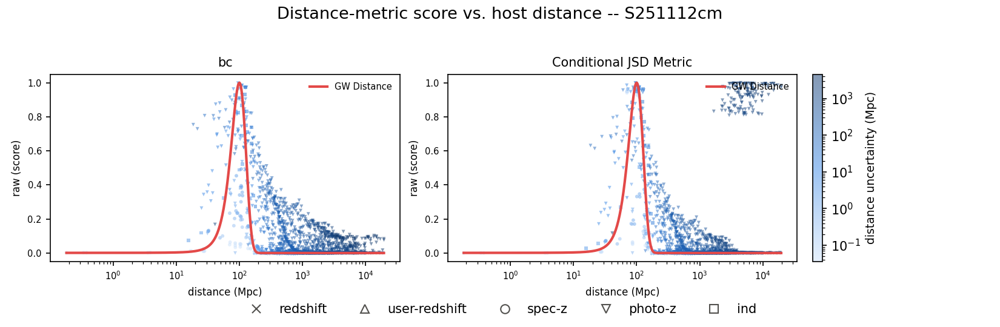
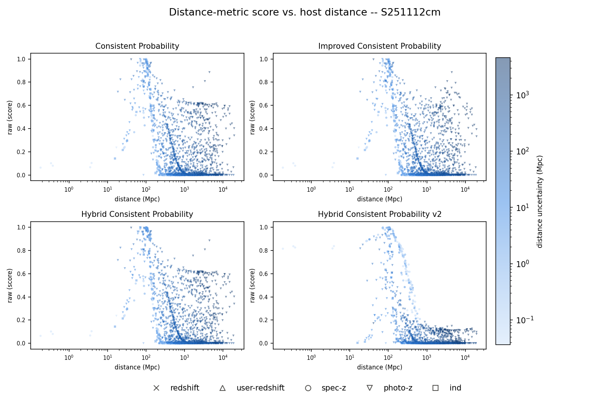
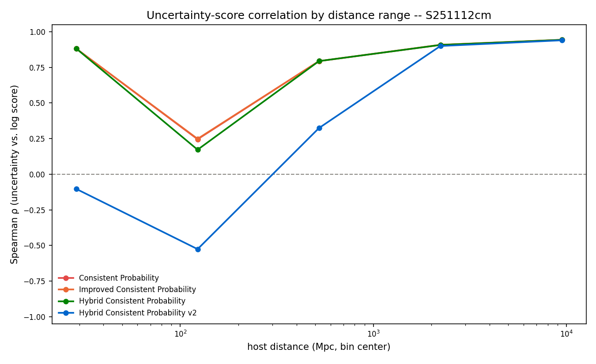
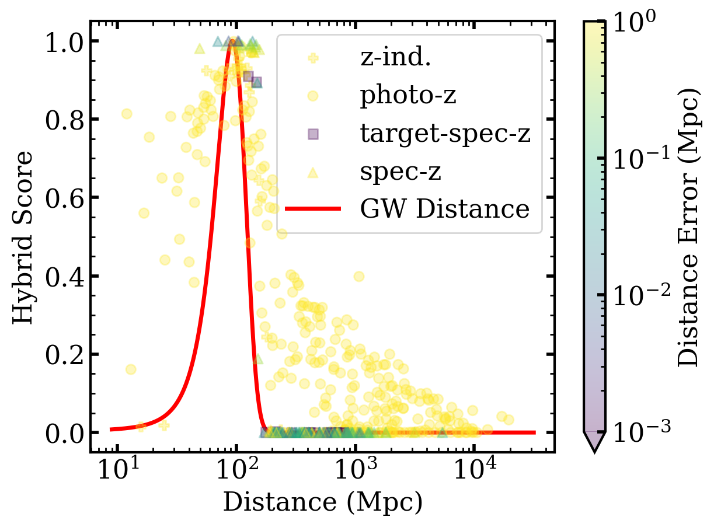
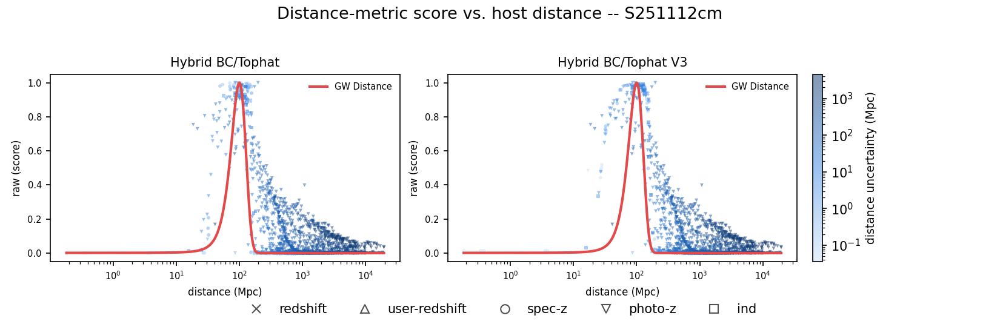
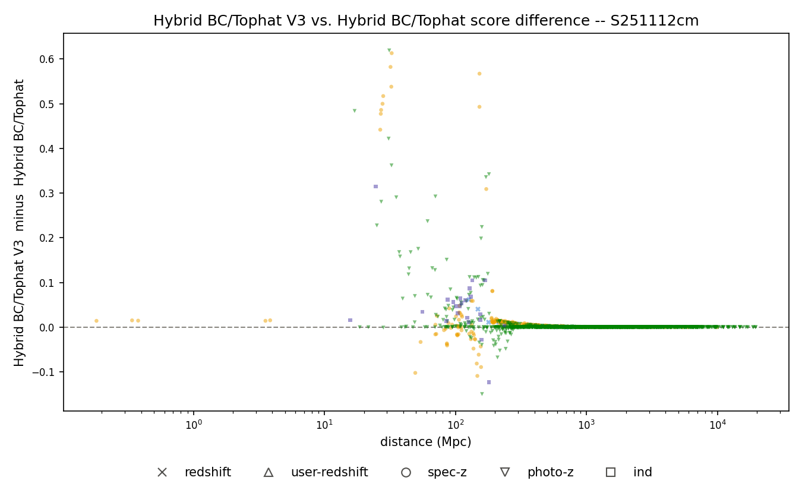
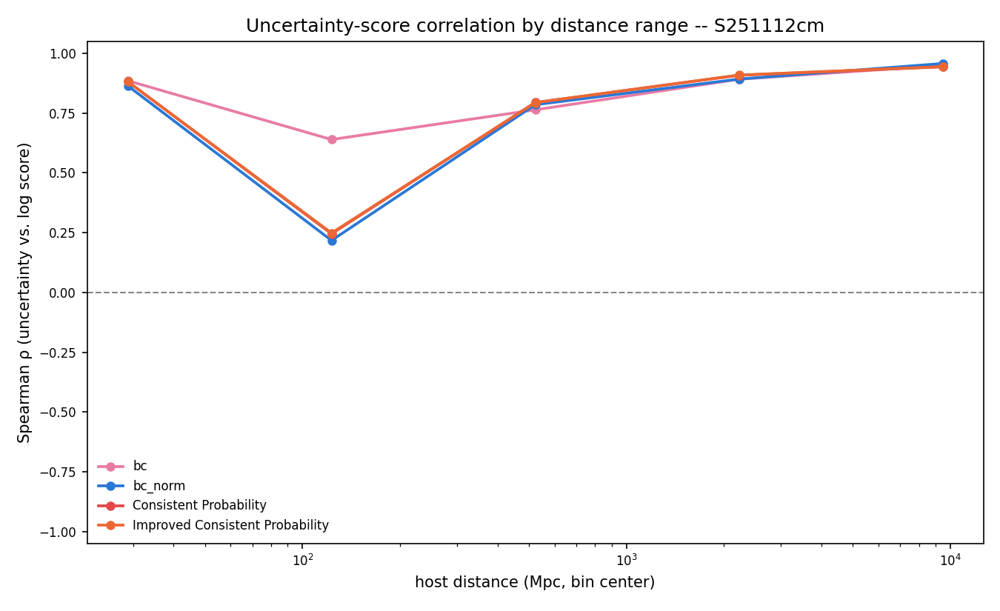

Start with background about the BNS/Kilo-nova and the other things we are searching for
- Potentially even include SSM (Sub-solar mass events as part of the discussion since S251112cm is a primary focus)
- Include why we are able to see kilo-nova, the time-domain astronomy aspect of it, and how we can combine photometric data with GW data to better identify candidates
- Introduce the concept of TROVE/SAGUORO and why the scoring matters

Scoring
- Add the flowchart image of all of the different aspects of scoring (in Noah's distance scoring paper)
- Potentially add some of the correlation analysis
- Transition to the distance scoring and currently how it is being done (BC)

Distance Scoring Deep-Dive
- What are the requirements for this distance scoring? What are the desired results
- phot-z and spec-z must be treated differently (Maybe include some background of what both of these are and why the desired scores are the way that they are)

- The iterations of the distance scoring that I have worked on
    - Information Theory Metrics (Jensen-Shannon Distance, Entropy comparison to uniform)

      

      *The earliest two approaches, real S251112cm data: plain Bhattacharyya coefficient (`bc`) and the JSD/z-score hybrid (`Conditional JSD Metric`), both with the GW distance curve overlaid. `bc` tracks the GW distance curve fairly cleanly. `Conditional JSD Metric` mostly does too, but has a cluster of anomalously high scores (~0.8-1.0) for photo-z hosts way out at ~2,000-10,000 Mpc -- a clear failure mode of the pure JSD-based approach that motivated moving toward the Consistent Probability family below.*

    - Consistent Probability method/Hybrid
    - Hybrid Methods (Information Theory/Consistent Probability Methods)

      

      *Side-by-side with real S251112cm data across this whole stretch of iterations: Consistent Probability -> Improved Consistent Probability -> Hybrid Consistent Probability -> Hybrid Consistent Probability v2, same axes/coloring throughout so the panels are directly comparable.*

    - Migrating the consistent probability method to use more robust statistics (median/MAD rather than mean/std)

      **Strength:** Hybrid Consistent Probability v2 (median/MAD) tightens spec-z scores dramatically (log10 score ~ -1 to -2) vs. the mean/std version's wide spread (median ~ -5 to -8).

      **Limitation:**

      

      *That same v2 version's uncertainty-vs-score correlation actually goes negative at close range (~30-150 Mpc) -- the opposite of the desired trend that the other three methods all get right. Worth showing as a "this fixed one thing but broke another" cautionary example; ties into the "Is this really necessary?" question in Real Data Considerations below.*

    - Noah's latest iteration of the hybrid function

      

      *Noah's own hybrid-score-vs-distance figure (single panel, GW distance curve overlaid) -- the "before" for the next bullet.*

    - My latest improvement of this hybrid function (hybrid_v3)
        - Tophat scoring slightly different
        - Logistic Weighting

      

      *Direct side-by-side of Hybrid BC/Tophat vs. Hybrid BC/Tophat V3, both with the GW distance curve overlaid (same style as Noah's figure above, so it reads as a direct extension of it).*

      

      *(V3 minus v1) score difference vs. distance -- makes the strengths/limitations concrete instead of eyeballing two panels. V3 mostly agrees with v1 (diff ~ 0 almost everywhere), but in the ~20-200 Mpc transition zone V3 is more consistent for well-measured hosts near the true distance (diff up to +0.6), at the cost of slightly lower scores (diff down to -0.16) for well-measured hosts that are close but not exactly centered on the GW mean -- a deliberate trade (V3's tilt term rewards exact centering over "anywhere in the box").*

Real Data Considerations (S251112cm results)
- Matching expected distribution

  

  *GW distance curve (red, normalized to peak 1, built from the median test_mean/test_std across all 2112 evaluated hosts) overlaid on the score-vs-distance scatter -- shows scores actually rising and falling with the real GW distance PDF shape rather than some arbitrary function of distance.*

- Time Efficiency

  Per-call execution time of the distance-scoring metrics, measured on 40 real host records sampled from `distance_metric_bias_records.json`, 20 timed repeats per record:

  | metric | mean (us) | median (us) | total (ms) |
  |---|---:|---:|---:|
  | bc_slow | 334.96 | 323.89 | 13.399 |
  | bc (analytic) | 15.73 | 14.87 | 0.629 |
  | bc_norm | 11772.94 | 11595.85 | 470.918 |
  | Consistent Probability | 2.45 | 2.17 | 0.098 |
  | Improved Consistent Probability | 5.55 | 5.20 | 0.222 |
  | Hybrid Consistent Probability | 8.37 | 7.79 | 0.335 |
  | Hybrid BC/Tophat | 47.91 | 38.34 | 1.916 |
  | Hybrid BC/Tophat V3 | 34.37 | 32.61 | 1.375 |

  `bc_slow`/`bc_norm` are the older numerical-integration metrics (build an `AsymmetricGaussian` PDF over a 100,000-point grid, then integrate) and aren't called anywhere in the current pipeline. `bc (analytic)` is the closed-form replacement now used internally by both `Hybrid BC/Tophat` metrics. The two active metrics (`Hybrid BC/Tophat`, `Hybrid BC/Tophat V3`) cost tens of microseconds per call, negligible next to the per-candidate network/DB wait (~7-10s seen during real collection runs).

- Correlation of distance_uncertainty/score (Is this really necessary?)

  

  *Current Spearman rho(uncertainty, score) by distance bin for Hybrid BC/Tophat vs. V3; both dip toward ~0 right around the GW peak (~120 Mpc) where uncertainty stops mattering much, and rise toward ~0.9+ far from it -- worth discussing whether the near-peak dip is actually a problem or just reflects that uncertainty genuinely matters less when a host is obviously right.*
