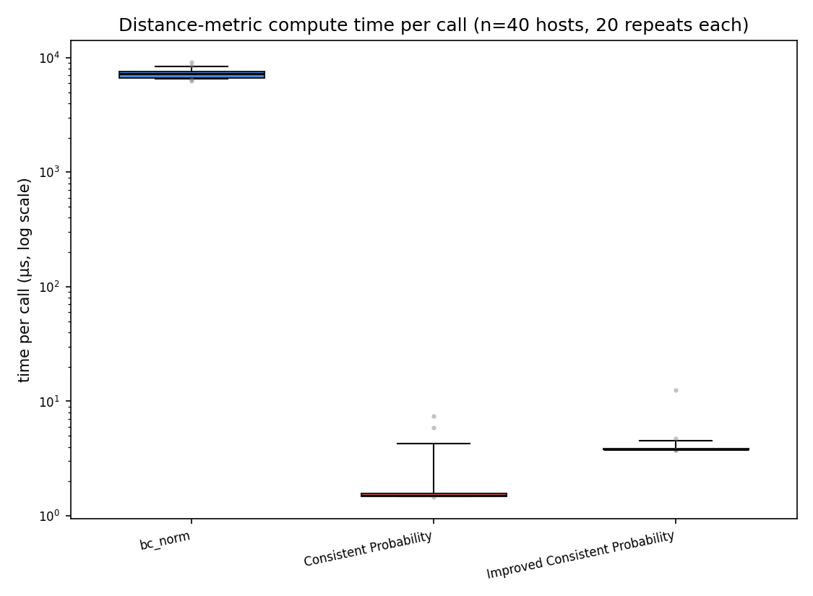

# Distance-metric compute time comparison

Per-call execution time of the three distance-scoring metrics (`bc_norm`,
`Consistent Probability`, `Improved Consistent Probability`), measured on 40
real host records sampled from `distance_metric_bias_records.json`, 20 timed
repeats per record. Produced by
`scoring/management/commands/time_distance_metrics.py`.

| metric | mean (us) | median (us) | total (ms) | x slowdown |
|---|---:|---:|---:|---:|
| bc_norm | 7268.42 | 7257.85 | 290.737 | 3609.99x |
| Consistent Probability | 2.01 | 1.51 | 0.081 | 1.00x |
| Improved Consistent Probability | 4.11 | 3.82 | 0.164 | 2.04x |



## Notes

- `bc_norm` numerically builds an `AsymmetricGaussian` PDF (with its own
  internal trapezoidal integration over a 100,000-point distance grid) and
  computes two Bhattacharyya-coefficient overlaps -- real numerical work.
- `Consistent Probability` and `Improved Consistent Probability` are both
  closed-form `erfc` expressions on scalars, so they're ~3-4 orders of
  magnitude cheaper. `Improved Consistent Probability` costs about 2x
  `Consistent Probability` for its extra tail-blending work.
- At ~2112 host records (a full collection run), `bc_norm` alone accounts for
  roughly 14-15s of pure compute, while both erfc-based metrics combined cost
  well under 1s -- negligible next to the per-candidate network/DB wait
  (~7-10s seen during real collection runs). Metric compute time is not a
  bottleneck in `check_distance_scores`; the SSH-tunneled galaxy queries are.

Reproduce with:

```
python manage.py time_distance_metrics \
    --records /home/sopanda25/trove/out/distance_metric_bias_records.json \
    --n 40 --repeats 20 \
    --output /home/sopanda25/trove/out/distance_metric_timing.png
```
