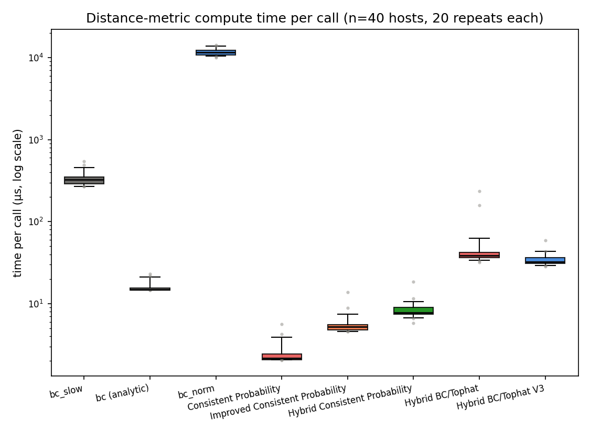

# Distance-metric compute time comparison

Per-call execution time of the distance-scoring metrics, measured on 40 real
host records sampled from `distance_metric_bias_records.json`, 20 timed
repeats per record. Produced by
`scoring/management/commands/time_distance_metrics.py`.

| metric | mean (us) | median (us) | total (ms) |
|---|---:|---:|---:|
| bc_slow | 334.96 | 323.89 | 13.399 |
| bc (analytic) | 15.73 | 14.87 | 0.629 |
| bc_norm | 11772.94 | 11595.85 | 470.918 |
| Consistent Probability | 2.45 | 2.17 | 0.098 |
| Improved Consistent Probability | 5.55 | 5.20 | 0.222 |
| Hybrid Consistent Probability | 8.37 | 7.79 | 0.335 |
| Hybrid BC/Tophat | 47.91 | 38.34 | 1.916 |
| Hybrid BC/Tophat V3 | 34.37 | 32.61 | 1.375 |



## Notes

- `bc_slow` and `bc_norm` are the older, numerical-integration metrics (build
  an `AsymmetricGaussian` PDF over a 100,000-point grid, then integrate) --
  `bc_norm` costs ~35x more than `bc_slow` since it does a *second* overlap
  (against a reshifted "best-case" host PDF) to normalize the score. Neither
  is called anywhere in the current pipeline (`host_distance_match()` has
  both commented out).
- `bc (analytic)` is the closed-form replacement now used internally by both
  `Hybrid BC/Tophat` and `Hybrid BC/Tophat V3` -- ~16us, a direct formula
  rather than a PDF build + integration.
- `Consistent Probability`, `Improved Consistent Probability`, and `Hybrid
  Consistent Probability` are all closed-form `erfc` expressions on scalars
  -- cheapest of the group (2-8us), cost scales with how much tail-blending/
  branching each does.
- `Hybrid BC/Tophat` and `Hybrid BC/Tophat V3` (the two currently active
  metrics) both call the analytic `bc()` plus a tophat-score term and a
  blend weight -- ~35-48us, still negligible next to the per-candidate
  network/DB wait (~7-10s seen during real collection runs).

Reproduce with:

```
python manage.py time_distance_metrics \
    --records /home/sopanda25/trove/out/distance_metric_bias_records.json \
    --n 40 --repeats 20 \
    --output /home/sopanda25/trove/out/distance_metric_timing.png
```
